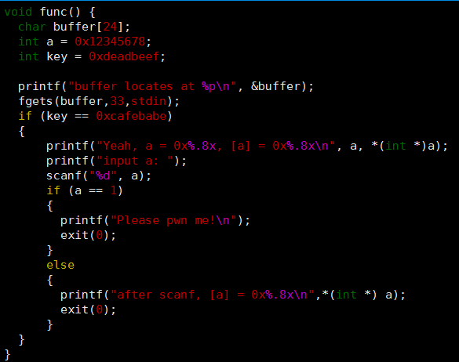
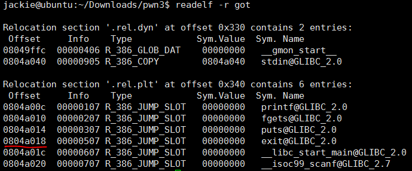
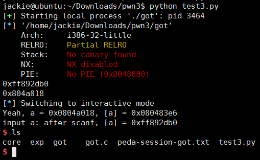

# PWN (3)
> 本题需要修改GOT(Global Offset Table)，从而执行注入的shellcode来达到获取shell的目的

## 预备知识
### GOT(Global Offset Table)
**概念：**每一个外部定义的符号在全局偏移表（Global offset Table）中有相应的条目，GOT位于ELF的数据段中，叫做GOT段。

**作用：**把位置无关的地址计算重定位到一个绝对地址。程序首次调用某个库函数时，运行时连接编辑器（rtld）找到相应的符号，并将它重定位到GOT之后每次调用这个函数都会将控制权直接转向那个位置，而不再调用rtld。

### PLT(Procedure Linkage Table)
过程连接表(Procedure Linkage Table)，一个PLT条目对应一个GOT条目.

当main()函数开始，会请求PLT中这个函数的对应GOT地址，如果第一次调用那么GOT会重定位到PLT，并向栈中压入一个偏移，程序的执行回到_init()函数，rtld得以调用就可以定位外部定义的符号的地址，第二次运行程序再次调用这个函数时程序跳入plt，对应的GOT入口点就是真实的函数入口地址。

动态连接器并不会把动态库函数在编译的时候就包含到ELF文件中,仅仅是在这个ELF被加载的时候,才会把那些动态函库数代码加载进来,之前系统只会在ELF文件中的GOT中保留一个调用地址.

### GOT覆盖技术
**原理：**由于GOT表是可写的，把其中的函数地址覆盖为我们shellcode地址，在程序进行调用这个函数时就会执行shellcode。

### scanf如果缺少`&`会怎么样?

ebp-0xc为局部变量a的地址，未初始化的条件下那里的内存内容无法确定，而程序直接将一个不确定的数值压栈作为scanf的第二个参数，那末就会导致向一个不确定的内存地址单元赋值.

## 题目解析
题目源码 （main函数中只调用了func）

反汇编func:

由此做出func的栈映像:

注意到buffer长24字节，fgets读入33字节(键入32个非换行符字符后敲回车发送第33个字符——换行符——结束). 结合栈映像可知，通过溢出最多只能覆盖到局部变量a的后一个字节处，无法覆盖返回地址. 所以**思路是**：借助源码中scanf的漏洞，让用户的输入覆盖GOT表中的某个函数；显然，覆盖exit更容易. 但要让scanf得以执行就必须用0xCAFEBABE覆盖局部变量key. 至于24字节的buffer，就用system("/bin/sh")的汇编代码作为shellcode来填充，它有23字节.

综上，得出 `payload = shellcode + 'A' + p32(0xCAFEBABC) + p32(exit_got_addr)`
其中，`exit_got_addr`为exit的地址，从GOT表获取：

填充后栈的内容变为:

之后调用scanf前，局部变量a的值(由栈映像知，a位于ebp-0xc，且其中内容已被覆盖为exit的入口)作为scanf的第二个参数被压栈，那末只需输入shellcode的地址(ebp-0x28，即buffer的地址)，GOT表中exit的地址就会被覆写，从而在本该执行exit的地方跳转执行shellcode.

## Python脚本及运行结果

从python脚本的输出可知，源程序中buffer的地址(即shellcode的地址为)0xff892db0，exit在GOT表中的地址为0x804a018，与通过`readelf -f got`查看到的结果一致. 由c程序的输出可知，局部变量a被成功覆盖为0x804a018，scanf获取输入后exit的入口被替换为shellcode的地址，最终拿到了shell.

## More
* buffer的地址0xff892db0，在32位程序中这是一个负数，但`str(0xff892db0)`返回的是无符号数值的字符串表示，因此需要改变符号，实现方法为取补码`0xff892db0-0x100000000`
* 要使攻击成功，需使用gcc的编译选项`-fno-stack-protector -z execstack`，取消堆栈保护并开启堆栈可执行

 