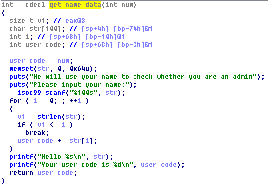
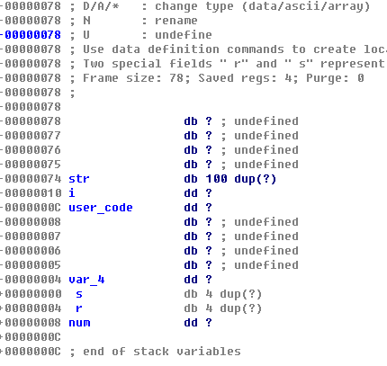
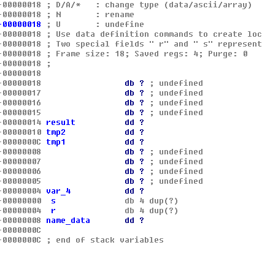
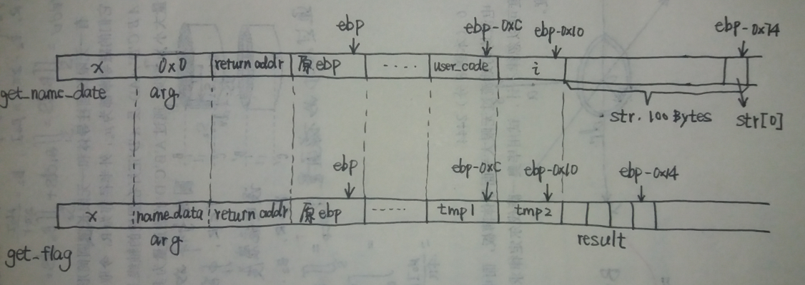
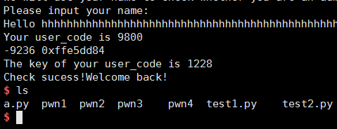

# PWN (4)
> 本题要求利用栈的残留数据发起攻击，拿到shell

## 使用IDA反编译二进制文件进行分析:

`main`函数:

`get_name_data`函数:

`get_flag`函数:

`get_name_data`获取用户名并计算一个`user_code`返回，不存在栈溢出的漏洞. `get_flag`里倒是存在一个漏洞: `result += tmp1 + tmp2`，容易发现，该语句之前未对局部变量`result`进行初始化，那么程序执行时会从栈里`ebp-xx`处取出一个不确定的值来使用.
考虑到`get_name_data`和`get_flag`参数类型和数量相同，因此具有相同的栈结构.

用IDA查看之:

由此可知，程序执行时两个函数的栈映像如下图所示:

跟踪两个函数的调用过程可以发现，`get_name_data`调用结束后esp指向x单元，之前压栈的参数和局部变量仍然留在内存中，但已经不再属于栈空间. 调用`get_flag`时，参数压栈，重建函数的栈空间. 如图，`get_flag`的局部变量`result`占用的4字节内存正好对应`get_name_data`的`str[96]`~`str[99]`! 只需构造特定的字符串就能控制`result`的初始值，从而控制`get_flag`的流程以此拿到shell

## 开始解题
### 1. 构造字符串
首先以 `'a' * 100` 进行测试：

结合源代码可知，`get_name_data`的返回值`user_code` = 9800，`get_flag`的局部变量`tmp1` = 9800, `tmp2` = 1228，由此计算出来的`result` != 1792. 其中，`tmp2`的1228是以9800为种子计算出来的一个随机数取模结果.

设`str[96]`,`str[97]`,`str[98]`,`str[99]`构成的4字节int值为`x`，则:

`result = x + 9800 + 1228`,

令`result = 1792`, 则 `x = -9236 = 0xffffdbec`

结合`get_name_data`中`user_code`的计算算法，构造如下字符串:

`95个字符 + '\0' + '\xec\xdb\xff\xff`

其中，前95个字符的ASCII码累加和(即user_code)必须等于9800，否则种子不同的话随机数也不同

不难算出，95个字符应该为:

`chr(104) * 94 + chr(24)`

> chr()为python函数，将ASCII码转换为相应字符

### 2. python脚本

执行后可拿到shell:

